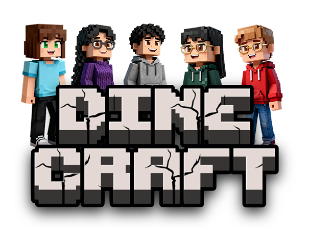

# DineCraft 🍔


Benvenuto nel repository ufficiale di **DineCraft**, un progetto web interamente dedicato a un'esperienza gastronomica leggendaria a tema Minecraft, dove i mondi dell'Overworld, del Nether e dell'End si incontrano.

Il progetto è stato sviluppato per il corso universitario di **Comunicazione Visiva e Design delle Interfacce** (**UniMiB**), Anno Accademico 2025/2026.

Il sito è interamente responsive ed è ospitato live su GitHub Pages al seguente indirizzo:  
👉 **https://stefanomandelli.github.io/UX-Factor-Minecraft**

---

## 👥 Il Team: UX-Factor

Il progetto è stato ideato, progettato e sviluppato dal team **UX-Factor**, composto da:
* **Annalisa Perrini** – Designer e Developer
* **Gloria Tognoli** – Designer e Developer
* **Nicola Matera** – Designer e Developer
* **Stefano Mandelli** – Designer e Developer
* **Valentina Giudice** – Designer e Developer

---

## 📂 Struttura del Progetto

Il sito si articola in diverse pagine, ciascuna pensata per una specifica fase dell'esperienza utente:

1.  **Home (`index.html`)**: La vetrina principale del locale. Introduce la lore del ristorante (la pace tra i Mob), mostra il menu e introduce le promozioni attive.
2.  **Ristorante (`ristorante.html`)**: Pagina "Chi Siamo" incentrata sulla narrazione del brand, sulla sostenibilità e sulla flessibilità del servizio.
3.  **Menu (`menu.html`)**: Diviso rigorosamente nelle tre dimensioni di gioco, con la possibilità di essere letto in tre lingue diverse (italiano, inglese e galactic) e include un sistema che permette agli utenti di nascondere o mostrare i piatti in base alle proprie esigenze o intolleranze alimentari.
4.  **Prenota (`prenota.html`)**: Pagina che permette agli utenti di completare la "Missione del Mese" scaricando la mappa per ottenere un codice segreto, sbloccando così un form di prenotazione guidato a 4 step.
5.  **Info & Contatti (`info.html`)**: Contiene le informazioni dei vari locali nei tre mondi e integra i comandi in chat di gioco (`/dinecraft -assistenza`, `-feedback`, `-collaborazioni`) per interagire con lo staff.
6.  **Promo del mese (`pagina-libera.html`)**: Pagina dedicata all'evento esclusivo "DineCraft x Umani", completa di spiegazione per illustrare come ottenere i gadget misteriosi in palio.

---

## 🛠️ Tecnologie Utilizzate

Per la realizzazione della piattaforma sono state impiegate le seguenti tecnologie e librerie:

* **HTML5 & CSS3**: Struttura semantica e stili;
* **Bootstrap 5**: Framework CSS utilizzato per garantire una griglia responsive solida, la gestione dei componenti (navbar, caroselli, schede) e utilities di allineamento;
* **JavaScript (ES6+)**: Logica di interazione lato client, gestione dei filtri dinamici, sistema di prenotazione a step e countdown promozionali;
* **Google `<model-viewer>`**: Integrazione e ottimizzazione di modelli 3D interattivi (formato `.glb`);
* **SEO & Open Graph Protocol**: Ottimizzazione completa dei metadati per i motori di ricerca e configurazione delle Twitter Cards / Open Graph per anteprime ricche sulle piattaforme social e di messaggistica.

---

## 💻 Come avviare il progetto localmente

1. Clonare il repository:
   ```bash 
      git clone https://github.com/stefanomandelli/UX-Factor-Minecraft.git 
   ```

2. Aprire la cartella del progetto.
3. Avviare il file index.html tramite un server locale (es. l'estensione Live Server di VS Code) per garantire il corretto caricamento dei moduli JavaScript e dei file 3D.